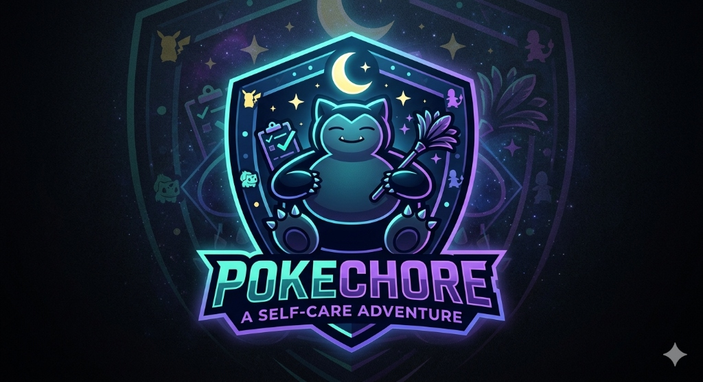

# PokeChore: A Self-Care Adventure 🎮✨

PokeChore is a gamified task and self-care tracker that turns your daily chores into a Pokémon-style RPG adventure. Level up your buddy, collect new Pokémon, and defeat bosses by completing your real-life tasks!

## Features
- **Gamified Chores**: Earn XP for completing Daily, Weekly, and Monthly tasks.
- **Buddy System**: Choose a Pokémon buddy to grow with you.
- **Evolution**: Watch your Pokémon evolve as you gain trainer XP.
- **Boss Battles**: Face legendary "Wild Encounters" as you progress through your tasks.
- **Collection**: Build your own PokéDex of self-care champions.
- **PWA Support**: Install it on your phone for a native app experience.

## Getting Started
1. Clone the repo
2. Run `npm install`
3. Run `npm run dev`

## Tech Stack
- React
- Vite
- Lucide React (Icons)
- Vanilla CSS (Glassmorphism & Retro Gaming UI)
